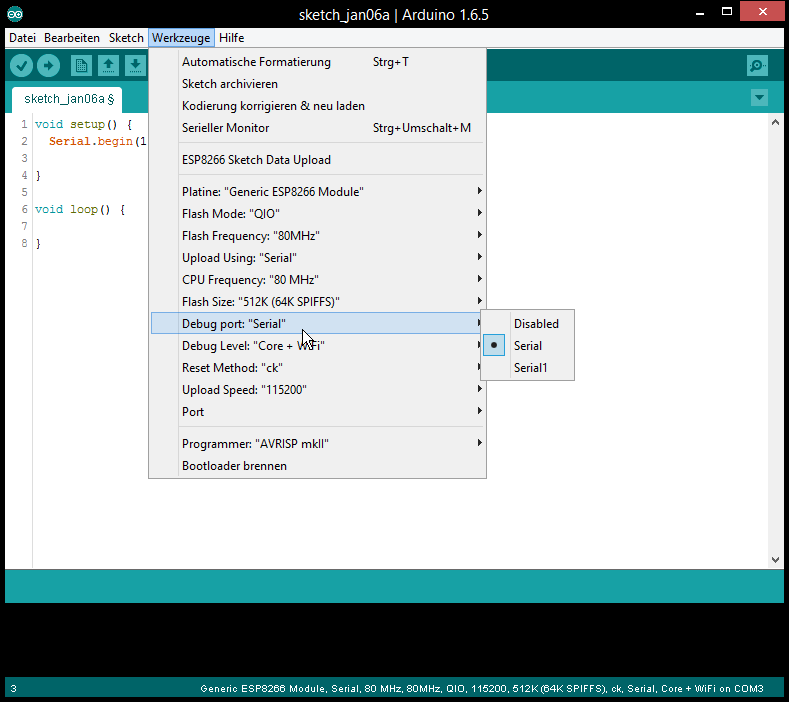
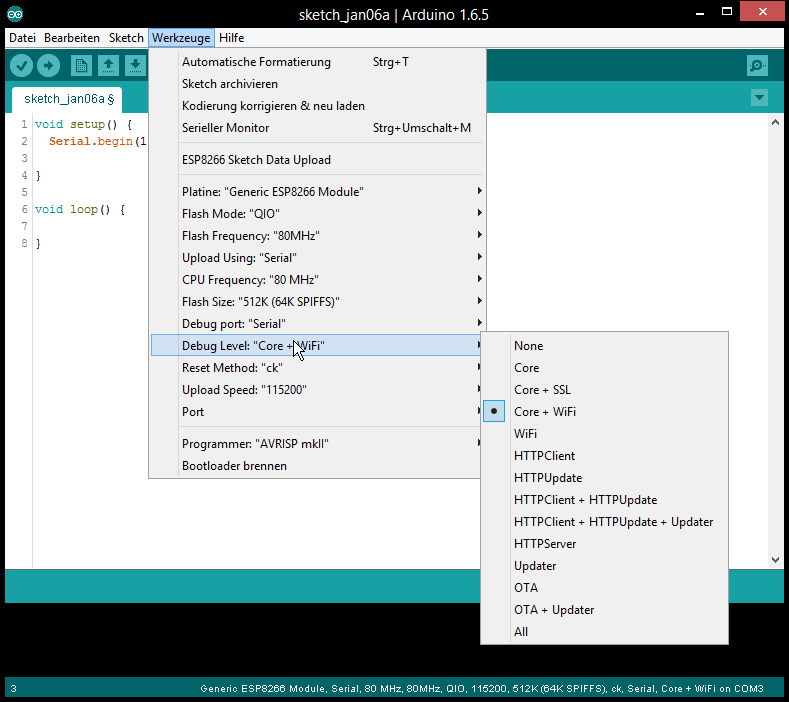
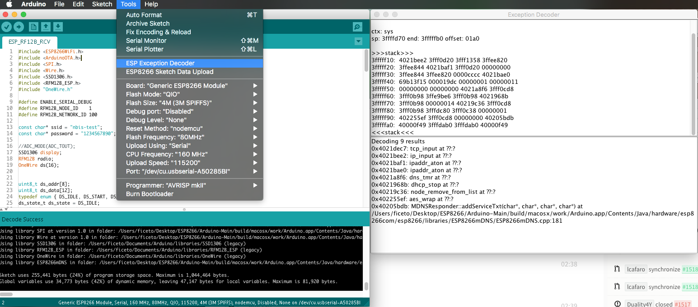

Урок 2. 
============

## Особливості відладки програм (Debugging)

З версії `2.1.0-rc1` `Arduino IDE` з'явилася функція відладки, яка управляється над меню `IDE`. В цьому меню можливо налаштувати повідомлення, що з'являються в режимі реального часу.

### Вимоги для можливості відладки

Для використання відладки необхідно обрати один з послідовних інтерфейсів `UART` (`Serial` або `Serial1`). Для цього послідовний іннтерфейс в `setup()` слід налаштувати з максимальною швидкістю.

```c
void setup() {
    Serial.begin(115200);
}

void loop() {

}
```

### Послідовність налаштування відладки
 
1.	Виберіть послідовний інтерфейс для повідомлень відладчика.
 

2.	Зробіть вибір типу / рівня налагоджувальних повідомлення.
  

3.	Перевірте, чи інтерфейс послідовного інтерфейсу ініціалізованого в `setup()`. 

4.	Запрограмуйте скетч.

5.	Перевірте термінал послідовнго інтерфейсу.

> Вибір послідовного інтерфейсу для виводу повімлень відладчика не виключає можливості його використання у самій програмі для власних цілей.


Для можливості використання відладки використовуються додаткові визначення (`defines`), що задаються командним рядком. Наприклад,  визначення порта має значення `DEBUG_ESP_PORT`, яке можна визначити: 
- Disabled: визначеня не виконано 
- Serial: Serial 
- Serial1: Serial1

Всі визначення для різних рівнів починаються з `DEBUG_ESP_`, повний список яких можна знайти у файлі [boards.txt](https://github.com/esp8266/Arduino/blob/master/boards.txt#L180).

### Приклад налаштування власних повідомлень відладчика

Налагоджувальні повідомлення будуть відображатися тільки у разі вибору відповідного порта для відладки в меню `IDE`.

```c
#ifdef DEBUG_ESP_PORT
#define DEBUG_MSG(...) DEBUG_ESP_PORT.printf( __VA_ARGS__ )
#else
#define DEBUG_MSG(...)
#endif
 
void setup() {
    Serial.begin(115200);
 
    delay(3000);
    DEBUG_MSG("bootup...\n");
}
 
void loop() {
    DEBUG_MSG("loop %d\n", millis());
    delay(1000);
}
```

### Дамп стеку


У разі якщо в ESP виникне збій, з'явиться повідомлення про виключення та буде переданий у термінал вміст стеку (дамп).
    
Приклад дампу стеку:
    
    Exception (0): epc1=0x402103f4 epc2=0x00000000 epc3=0x00000000 excvaddr=0x00000000 depc=0x00000000
    
    ctx: sys
    sp: 3ffffc10 end: 3fffffb0 offset: 01a0
    
    >>>stack>>>
    3ffffdb0:  40223e00 3fff6f50 00000010 60000600
    3ffffdc0:  00000001 4021f774 3fffc250 4000050c
    3ffffdd0:  400043d5 00000030 00000016 ffffffff
    3ffffde0:  400044ab 3fffc718 3ffffed0 08000000
    3ffffdf0:  60000200 08000000 00000003 00000000
    3ffffe00:  0000ffff 00000001 04000002 003fd000
    3ffffe10:  3fff7188 000003fd 3fff2564 00000030
    3ffffe20:  40101709 00000008 00000008 00000020
    3ffffe30:  c1948db3 394c5e70 7f2060f2 c6ba0c87
    3ffffe40:  3fff7058 00000001 40238d41 3fff6ff0
    3ffffe50:  3fff6f50 00000010 60000600 00000020
    3ffffe60:  402301a8 3fff7098 3fff7014 40238c77
    3ffffe70:  4022fb6c 40230ebe 3fff1a5b 3fff6f00
    3ffffe80:  3ffffec8 00000010 40231061 3fff0f90
    3ffffe90:  3fff6848 3ffed0c0 60000600 3fff6ae0
    3ffffea0:  3fff0f90 3fff0f90 3fff6848 3fff6d40
    3ffffeb0:  3fff28e8 40101233 d634fe1a fffeffff
    3ffffec0:  00000001 00000000 4022d5d6 3fff6848
    3ffffed0:  00000002 4000410f 3fff2394 3fff6848
    3ffffee0:  3fffc718 40004a3c 000003fd 3fff7188
    3ffffef0:  3fffc718 40101510 00000378 3fff1a5b
    3fffff00:  000003fd 4021d2e7 00000378 000003ff
    3fffff10:  00001000 4021d37d 3fff2564 000003ff
    3fffff20:  000003fd 60000600 003fd000 3fff2564
    3fffff30:  ffffff00 55aa55aa 00000312 0000001c
    3fffff40:  0000001c 0000008a 0000006d 000003ff
    3fffff50:  4021d224 3ffecf90 00000000 3ffed0c0
    3fffff60:  00000001 4021c2e9 00000003 3fff1238
    3fffff70:  4021c071 3ffecf84 3ffecf30 0026a2b0
    3fffff80:  4021c0b6 3fffdab0 00000000 3fffdcb0
    3fffff90:  3ffecf40 3fffdab0 00000000 3fffdcc0
    3fffffa0:  40000f49 40000f49 3fffdab0 40000f49
    <<<stack<<<
    

Перше число після Exception надає інформацію про причину скидання. Повний перелік можливих причин збою можна знайти за адресою: http://arduino-esp8266.readthedocs.io/en/2.4.0/exception_causes.html, шіснадцяткові коди, що навендені вище, є вмістом стеку.
    
Decode
It’s possible to decode the Stack to readable information. For more info see the Esp Exception Decoder tool.

Длоя того, щоб декодувати вміст стеку необхідно використовувати інструмент [`Esp Exception Decoder tool`](https://github.com/me-no-dev/EspExceptionDecoder).

  


## Функції формування часових затримок та подій
    
Функції `millis()` і `micros()` повертають кількість мілісекунд і мікросекунд відповідно, що минули після скидання.
    
Функція delay(ms) призупиняє роботу основної програми на заданий час в мілісекундах і резервує цей час для обробки завдань `Wi-Fi` та `TCP/IP`. 

Функція – `delayMicroseconds(us)` призначена для паузи на задане число мікросекунд.
    
Пам'ятайте, що є багато задач, що повинні забезпечувати стабільну роботу `Wi-Fi`, і для них потрібно періодично виділяти час роботи. `Wi-Fi` і `TCP/IP` бібліотека отримують можливість обробляти будь-які очікувані події кожен раз , коли функція `loop()` завершується, або коли викликається функція `delay`. 
    
Якщо у вас в програмі є будь яке оброблення, що займає багато часу (> 50 мс) без виклику `delay`, ви можете розглянути варіант спеціально додати виклик функції `delay`  для підтримки нормального виконання стеку `Wi-Fi`.
    
Існує також функція `yield()`, яка еквівалентна `delay(0)`. Функція  `delayMicroseconds` не поступається часом виконання іншим завданням, тому використання її для затримки більш ніж на 20 мілісекунд не рекомендується.

**********


Paragraphs are separated by a blank line.
---
2nd paragraph. *Italic*, **bold**, and `monospace`. Itemized lists
look like:

  * this one
  * that one
  * the other one

Note that --- not considering the asterisk --- the actual text
content starts at 4-columns in.

> Block quotes are
> written like so.
>
> They can span multiple paragraphs,
> if you like.

Use 3 dashes for an em-dash. Use 2 dashes for ranges (ex., "it's all
in chapters 12--14"). Three dots ... will be converted to an ellipsis.
Unicode is supported. ☺


An h2 header
------------

Here's a numbered list:

 1. first item
 2. second item
 3. third item


### An h3 header ###

Now a nested list:

 1. First, get these ingredients:

      * carrots
      * celery
      * lentils

 2. Boil some water.

 3. Dump everything in the pot and follow
    this algorithm:

        find wooden spoon
        uncover pot
        stir
        cover pot
        balance wooden spoon precariously on pot handle
        wait 10 minutes
        goto first step (or shut off burner when done)

    Do not bump wooden spoon or it will fall.

Notice again how text always lines up on 4-space indents (including
that last line which continues item 3 above).

Here's a link to [a website](http://foo.bar), to a [local
doc](local-doc.html), and to a [section heading in the current
doc](#an-h2-header). Here's a footnote [^1].

[^1]: Footnote text goes here.

Tables can look like this:

size  material      color
----  ------------  ------------
9     leather       brown
10    hemp canvas   natural
11    glass         transparent

Table: Shoes, their sizes, and what they're made of

(The above is the caption for the table.) Pandoc also supports
multi-line tables:

--------  -----------------------
keyword   text
--------  -----------------------
red       Sunsets, apples, and
          other red or reddish
          things.

green     Leaves, grass, frogs
          and other things it's
          not easy being.
--------  -----------------------

A horizontal rule follows.

***

Here's a definition list:

apples
  : Good for making applesauce.
oranges
  : Citrus!
tomatoes
  : There's no "e" in tomatoe.

Again, text is indented 4 spaces. (Put a blank line between each
term/definition pair to spread things out more.)

Here's a "line block":

| Line one
|   Line too
| Line tree

and images can be specified like so:


Inline math equations go in like so: $\omega = d\phi / dt$. Display
math should get its own line and be put in in double-dollarsigns:

$$I = \int \rho R^{2} dV$$

And note that you can backslash-escape any punctuation characters
which you wish to be displayed literally, ex.: \`foo\`, \*bar\*, etc.


Приклади оформлення:
---
Colons can be used to align columns.

| Tables        | Are           | Cool  |
| ------------- |:-------------:| -----:|
| col 3 is      | right-aligned | $1600 |
| col 2 is      | centered      |   $12 |
| zebra stripes | are neat      |    $1 |

There must be at least 3 dashes separating each header cell.
The outer pipes (|) are optional, and you don't need to make the 
raw Markdown line up prettily. You can also use inline Markdown.


Three or more...

---

Hyphens
***

Asterisks

___

Underscores